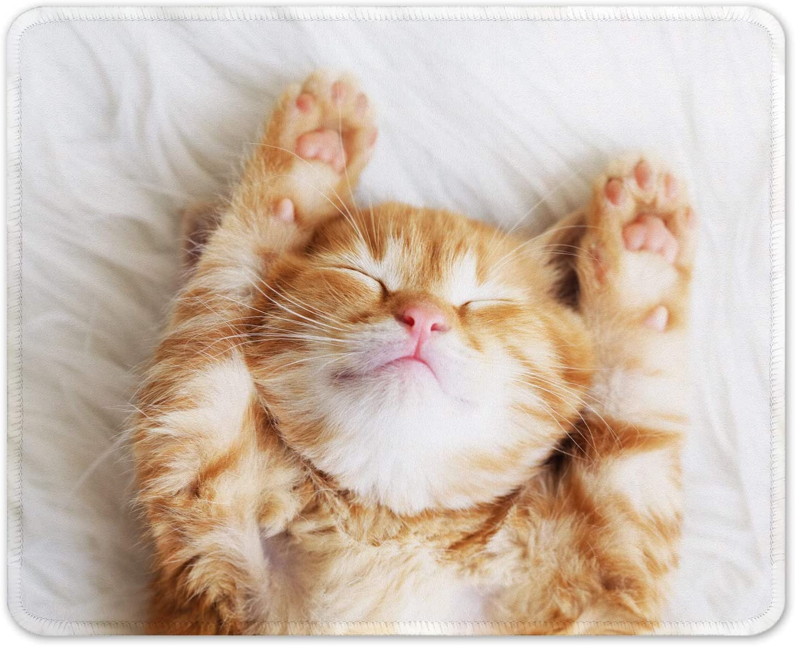

# Инструкция для работы с MarkDown.

## Выделение текста:

Чтобы выделить текст курсивом, необходимо обрамить его звёздочками (*), или знаком нижнего подчёркивания (_). Например, *вот так* или _вот так_.

Чтобы выделить текст полужирным, необходимо обрамить его двойными звёздочками (**), или двойным знаком нижнего подчёркивания (__). Например, **вот так** или __вот так__.

Альтернативные способы выделения текста полужирным или курсивом нужны для того чтобы мы могли совмещать оба этих способа. Например, _текст может быть выделен курсивом и при этом быть **полужирным**_.

## Работа со списками:
Чтобы выделить ненумерованный список, используйте (*).
## Работа с изображениями:

Чтобы вставить изображение в текст, достаточно написать следующее:

Часть в квадратных скобках – это так называемый альтернативный текст, который важен по следующим причинам:
1. Для доступности. Программы чтения с экрана читают именно его. Например, для тех, кто плохо видит.
2. Этот текст будет отображаться вместо изображения, если файл изображения не может быть загружен.
3. Он обеспечивает контекст и описание изображения для поисковых систем, помогая им с поиском.

## Работа с ссылками:

## Работа с таблицами:

## Работа с цитатами:

## Заключение: